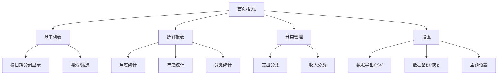

# PWA 记账应用开发计划

## 背景

基于产品需求，开发一个纯本地运行的PWA记账应用，支持语音输入、文字输入、AI辅助识别、离线使用、数据本地存储与导出、以及报表统计功能。

## 技术架构

| 层面 | 技术选型 | 说明 |
|------|---------|------|
| 框架 | Vite + Vue 3 (Composition API) | 响应式框架，组件化开发 |
| 路由 | Vue Router 4 | SPA页面路由管理 |
| 状态管理 | Pinia | 轻量级状态管理 |
| UI | 原生CSS + 自定义设计系统 | 移动优先，iOS风格 |
| 数据存储 | IndexedDB (via Dexie.js) | 结构化本地存储 |
| 语音识别 | Web Speech API | 浏览器原生语音识别 |
| AI识别 | Transformers.js (本地推理) | 浏览器端运行小模型 |
| PWA | Workbox | Service Worker管理 |
| 图表 | Chart.js | 轻量级图表库 |

> [!NOTE]
> 关于AI功能：产品需求明确要求引入 `Transformers.js` 本地小型推理模型，并针对早餐店特定经营材料（黄小米、黑米、包子等）进行识别。
> 方案调整为：
> - **模型选择**：使用 `@xenova/transformers` 在浏览器中运行。考虑到纯前端环境的性能和加载速度限制，将采用 **特征提取(Feature Extraction) / 零样本分类(Zero-Shot Classification)** 模型（如 `Xenova/bge-micro-zh-v1.5` 等轻量级中文模型），结合上下文信息。
> - **实体提取**：利用小型模型的能力结合模式匹配，精准提取出：**日期**（如5.14号）、**物品/分类**（如黄小米、粉丝煎饺）、**金额**（如28.45）。
> - **性能优化**：将推理代码移入 **Web Worker**，利用 IndexedDB 缓存模型，避免下载模型和执行推理时阻塞主线程，保证页面流畅。
> - **图片识别**：暂缓，聚焦于文本和语音识别的本地化推理。

## 应用页面结构

## Proposed Changes

### 1. 项目初始化与基础配置

#### [NEW] package.json
- Vite + Vue 3项目配置
- 依赖：vue、vue-router、pinia、dexie、chart.js、vite-plugin-pwa

#### [NEW] vite.config.js
- Vite配置，Vue插件、PWA插件集成

#### [NEW] index.html
- 应用入口，移动端meta标签，挂载Vue应用

#### [NEW] manifest.json
- PWA配置：应用名称、图标、启动画面、主题色
- `display: standalone` 实现全屏体验
- iOS特定的meta标签支持

---

### 2. 设计系统与样式

#### [NEW] src/styles/variables.css
- CSS自定义属性：颜色系统（支持浅色和深色主题，默认为浅色）、间距、圆角、阴影、动画
- 移动优先的响应式断点

#### [NEW] src/styles/base.css
- 全局重置、字体加载（思源黑体/Inter）
- iOS安全区域适配

#### [NEW] src/styles/components.css
- 按钮、卡片、输入框、导航栏等组件样式
- 毛玻璃效果、微动画

#### [NEW] src/styles/pages.css
- 各页面特定样式

---

### 3. 数据层

#### [NEW] src/db/database.js
- Dexie.js数据库定义
- 表结构：
  - `records`：记账记录（id, amount, type, categoryId, note, date, createdAt）
  - `categories`：分类（id, name, icon, type, order, isDefault）

#### [NEW] src/db/seed.js
- 默认分类数据初始化（餐饮、交通、购物、娱乐、工资等）

---

### 4. 核心功能模块

#### [NEW] src/composables/useSpeech.js
- Web Speech API封装为Vue Composable
- 响应式的识别状态（isListening, transcript）
- 语音识别启停控制

#### [NEW] src/workers/ai.worker.js
- Web Worker 文件，用于在后台线程运行 `Transformers.js`，避免阻塞主线程。
- 负责模型的加载、缓存、以及推理（特征提取/相似度匹配）。

#### [NEW] src/services/parser.js
- 重构解析器：与 `ai.worker.js` 通信。
- 处理自然语言并提取：金额、分类、备注、日期。
- 示例："5.14号黄小米28.45" → { date: "2026-05-14", amount: 28.45, category: "黄小米" }
- 针对早餐店特定的原材料（黄小米，黑米，白米，糯米，燕麦，粉丝，花生，大豆，白砂糖等）和成品（粉丝煎饺，小笼包，油条，白馒头，红糖馒头，紫薯包等）进行准确匹配。

#### [NEW] src/services/export.js
- 数据导出CSV功能
- 支持按时间范围筛选导出

---

### 5. Vue应用与页面组件

#### [NEW] src/main.js
- Vue应用创建，挂载Router和Pinia

#### [NEW] src/App.vue
- 根组件，`<router-view>` + 底部导航栏
- 页面切换过渡动画（`<Transition>`）

#### [NEW] src/router/index.js
- Vue Router配置，hash模式
- 路由：/（首页）、/records、/stats、/categories、/settings

#### [NEW] src/stores/records.js
- Pinia Store：记账记录的CRUD操作
- 与Dexie.js数据库交互

#### [NEW] src/stores/categories.js
- Pinia Store：分类管理
- 默认分类初始化

#### [NEW] src/views/HomeView.vue
- 首页/记账页面
- 语音输入按钮（按住说话）
- 文字快速输入区
- AI解析结果预览与确认
- 今日支出摘要

#### [NEW] src/views/RecordsView.vue
- 账单列表页
- 按日期分组显示
- 左滑删除
- 搜索筛选功能

#### [NEW] src/views/StatsView.vue
- 统计报表页
- 月度/年度支出趋势图（折线图）
- 分类占比图（环形图）
- 月/年切换器

#### [NEW] src/views/CategoriesView.vue
- 分类管理页
- 支出/收入分类Tab
- 拖拽排序
- 新增/编辑/删除分类

#### [NEW] src/views/SettingsView.vue
- 设置页面
- 主题切换（浅色/深色）
- 导出CSV
- 数据备份/恢复（JSON）
- 关于信息

#### [NEW] src/components/NavBar.vue
- 底部导航栏组件

#### [NEW] src/components/AppModal.vue
- 通用弹窗组件（Teleport到body）

#### [NEW] src/components/AppToast.vue
- 轻提示组件（Teleport到body）

---

### 6. PWA配置

#### [NEW] sw.js
- Service Worker
- 缓存策略：Cache First（静态资源）
- 离线支持

#### [NEW] public/icons/
- 应用图标（多尺寸：72, 96, 128, 144, 152, 192, 384, 512）
- Apple Touch Icon

---

## 设计风格

| 元素 | 描述 |
|------|------|
| 整体风格 | 现代简约，iOS风格毛玻璃效果 |
| 主色调 | 渐变蓝紫色（#667EEA → #764BA2）|
| 背景 | **默认为浅色模式**（干净的白色/浅灰底色），支持切换至深色模式 |
| 卡片 | 毛玻璃效果，微妙的边框发光 |
| 动画 | 页面切换滑动，按钮微交互，数字滚动 |
| 字体 | Inter + 系统中文字体 |
| 图标 | Emoji作为分类图标（无需额外图标库）|

## 开发顺序

1. **Phase 1**：项目初始化 + 设计系统 + 数据层
2. **Phase 2**：首页记账功能（文字输入 + AI解析）
3. **Phase 3**：账单列表 + 分类管理
4. **Phase 4**：语音输入集成
5. **Phase 5**：统计报表
6. **Phase 6**：设置页（导出CSV、备份恢复）
7. **Phase 7**：PWA配置（Service Worker、离线支持、图标）
8. **Phase 8**：测试与优化

## Verification Plan

### Automated Tests
- 在浏览器中启动开发服务器，验证各页面功能
- 测试记账流程：输入 → 解析 → 保存 → 显示
- 验证PWA安装提示和离线功能

### Manual Verification
- 在iPhone Safari中测试"添加到主屏幕"功能
- 测试语音输入功能
- 验证数据持久化（刷新页面后数据不丢失）
- 测试CSV导出功能

> [!IMPORTANT]
> 关于iCloud同步：产品需求中提到"支持iCloud数据同步"，但由于这是纯PWA应用（无后端服务），且要求"先不做在线相关"，iCloud同步将作为后续迭代功能。当前版本支持手动数据备份/恢复（JSON文件导出导入）作为替代方案。

## Open Questions

> [!IMPORTANT]
> 1. **货币单位**：默认使用人民币（¥），是否需要支持其他货币？
> 2. **预算功能**：是否需要月度预算设置和超支提醒？
> 3. **多账本**：是否需要支持多个账本（如个人、家庭、旅行等）？
